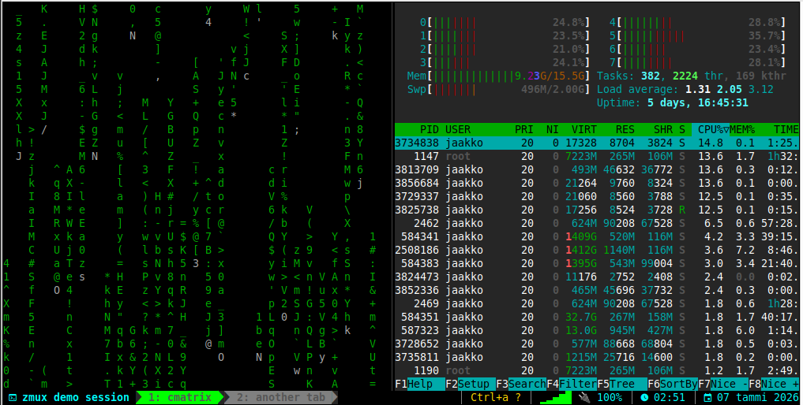

# zmux

**zmux** is a tmux configuration that makes tmux behave as closely as possible to [Zellij](https://zellij.dev/), providing a modern, modal terminal multiplexer experience.



## Features

- 🎯 **Zellij-like keybindings**: Modal interface with Pane, Tab, Resize, Move, and Scroll modes
- 🎨 **Modern status bar**: Clean, minimal design inspired by Zellij
- 🔌 **Plugin integration**: Essential tmux plugins pre-configured
- 📦 **Easy installation**: One-command setup script
- 🔄 **Session management**: Automatic session save/restore
- 📚 **Comprehensive docs**: Philosophy, keymaps, and differences explained

## Quick Start

### Installation

```bash
git clone https://github.com/jvuori/zmux.git
cd zmux
./install.sh
```

### First Run

1. Start tmux: `tmux` (or use `~/.config/tmux/scripts/tmux-start.sh` for automatic session restoration)
2. Install plugins: Press `Ctrl+a`, then `i` (this uses tmux prefix for plugin installation)
3. Reload config: Press `Ctrl+a`, then `r` (custom binding)

### Automatic Session Restoration

zmux includes a smart session starter that:

- **Restores the last active session** if sessions exist
- **Creates a new "default" session** if no sessions exist

To use it, you can either:

**Option 1: Use the script directly**

```bash
~/.config/tmux/scripts/tmux-start.sh
```

**Option 2: Create an alias (recommended)**
Add to your `~/.bashrc` or `~/.zshrc`:

```bash
alias tmux='~/.config/tmux/scripts/tmux-start.sh'
```

**Option 3: Create a function (allows passing arguments)**
Add to your `~/.bashrc` or `~/.zshrc`:

```bash
tmux() {
    if [ "$#" -eq 0 ]; then
        ~/.config/tmux/scripts/tmux-start.sh "$@"
    else
        command tmux "$@"
    fi
}
```

### Fix Existing Installation

If you have an old tmux configuration and the install script didn't update it:

```bash
./fix-installation.sh
```

This will backup your old config and create a symlink to zmux.

### Update Installation

To update an existing zmux installation with the latest configuration:

```bash
./update.sh
```

This will:

- Backup your current configuration
- Update all configuration files
- Reload the config in active tmux sessions
- Guide you through plugin updates

### Reload Configuration

After installing or updating zmux, reload the configuration in active tmux sessions:

```bash
./reload-config.sh
```

Or manually in tmux: press prefix, then type `:source-file ~/.tmux.conf`

### Shell Configuration (Required!)

zmux uses `Ctrl+p`, `Ctrl+n`, `Ctrl+h`, and `Ctrl+a` which conflict with shell readline shortcuts. You **must** configure your shell:

```bash
./setup-shell.sh
```

This will automatically add the necessary configuration to your `~/.bashrc` or `~/.zshrc`.

After running, reload your shell:

```bash
source ~/.bashrc  # or source ~/.zshrc
```

**Important:** Without this step, the keybindings won't work because your shell will intercept them before tmux can handle them.

See [docs/shell-config.md](docs/shell-config.md) for manual setup or more details.

### Verify Installation

```bash
~/.config/tmux/scripts/doctor.sh
```

## Key Bindings

zmux uses Zellij's default keybindings - direct key combinations (no prefix needed):

### Lock Mode

- **Lock/Unlock**: `Ctrl+l` - Toggles lock mode

When lock mode is enabled:

- ✅ **All keyboard input goes directly to the application** (like Ctrl+p for fzf, Ctrl+s for vim search, etc.)
- ✅ **Visual indicator** shows 🔒 LOCK in the status bar
- ✅ **Only Ctrl+l works** to toggle lock mode off and restore tmux keybindings
- ✅ **Perfect for applications** that need Ctrl+\* keybindings (fzf, vim, lazygit, neovim with telescope, etc.)

This is zmux's implementation of Zellij's "Lock mode" and solves the problem where tmux consumes keybindings needed by applications.

### Git Operations

- **Git branch**: `Ctrl+g, b` - Insert branch name into command line (requires fzf)

Example workflow:
```bash
$ git checkout [Ctrl+g, b]
> [fzf opens with branches]
> Type to filter: "feature"
> [Press Enter to insert branch name]
$ git checkout feature/new-api [cursor here]
```

### Modes

- **Pane mode**: `Ctrl+p` - Manage panes (split, close, navigate)
- **Resize mode**: `Ctrl+n` - Resize panes with arrow keys
- **Move mode**: `Ctrl+h` - Move/reorder panes
- **Tab mode**: `Ctrl+t` - Manage tabs/windows
- **Scroll mode**: `Ctrl+s` - Scroll and copy mode
- **Session mode**: `Ctrl+o` - Session management (create, switch, detach)

### Quick Actions

- **Quit**: `Ctrl+q` - Kill all sessions
- **Reload config**: `Ctrl+a r` (custom, not in Zellij)
- **Session switcher**: `Ctrl+a s` (custom, not in Zellij)

See [docs/keymap.md](docs/keymap.md) for the complete keymap reference.

## Project Structure

```
zmux/
├── README.md
├── install.sh              # Installation script
├── uninstall.sh            # Uninstallation script
├── tmux/                   # tmux configuration files
│   ├── tmux.conf          # Main configuration
│   ├── keybindings.conf   # Keybindings
│   ├── statusbar.conf     # Status bar config
│   ├── sessions.conf      # Session management
│   └── modes/             # Mode-specific configs
│       ├── pane.conf
│       ├── tab.conf
│       ├── resize.conf
│       └── move.conf
├── plugins/
│   └── plugins.conf       # Plugin configuration
├── scripts/
│   ├── session-switcher.sh # Interactive session switcher
│   └── doctor.sh          # Installation checker
└── docs/
    ├── philosophy.md      # Design philosophy
    ├── keymap.md          # Complete keymap reference
    └── differences-vs-zellij.md # Comparison with Zellij
```

## Configuration

Configuration files are installed to `~/.config/tmux/`. The main config file is `tmux.conf`, which sources all other configuration files.

### Customization

You can customize zmux by editing files in `~/.config/tmux/`:

- `keybindings.conf` - Change keybindings
- `statusbar.conf` - Customize status bar appearance
- `sessions.conf` - Session management settings
- `modes/*.conf` - Mode-specific configurations

After making changes, reload the config with `Ctrl+a r`.

## Plugins

zmux includes the following plugins (installed via TPM):

### Core & Session Experience

- **tmux-sensible** - Sensible defaults
- **tmux-resurrect** - Save/restore sessions (prefix + Ctrl+s save, prefix + Ctrl+r restore)
- **tmux-continuum** - Auto-save sessions (autosave every 15 minutes, auto-restore on start)

### Discoverability & UX Guidance

- **tmux-which-key** - Keybinding hints (shows available keys after prefix)
- **tmux-prefix-highlight** - Prefix indicator (shows in status bar when prefix is active)

### Sessions, Windows & Navigation

- **tmux-fzf** - Interactive session/window/pane switcher (fzf-based UI)

### Additional Useful Plugins

- **tmux-yank** - Better clipboard integration
- **tmux-open** - Open files/URLs
- **tmux-copycat** - Enhanced search
- **tmux-pain-control** - Better pane navigation

### Installing Plugins

After installation or update, install plugins:

**In tmux:**

- Press `Ctrl+a`, then `i` to install all plugins
- Press `Ctrl+a`, then `u` to update existing plugins

**From command line:**

```bash
tmux run '~/.tmux/plugins/tpm/bin/install_plugins'
tmux run '~/.tmux/plugins/tpm/bin/update_plugins' all
```

**Note:** After running `update.sh`, you need to install any new plugins that were added to the configuration.

## Uninstallation

```bash
./uninstall.sh
```

This will:

- Remove configuration files
- Remove the symlink to `~/.tmux.conf`
- Optionally remove plugins and tmux itself

## Documentation

- [Philosophy](docs/philosophy.md) - Design principles and goals
- [Keymap Reference](docs/keymap.md) - Complete keybinding guide
- [Differences vs Zellij](docs/differences-vs-zellij.md) - What's different and why

## Requirements

- **tmux** 2.0+ (installed automatically by install script)
- **git** (for TPM and plugin installation)
- **bash** (for scripts)

### Optional

- **fzf** - For enhanced session switching (recommended)

## Troubleshooting

### Keybindings not working (Ctrl+p shows previous command, etc.)

This happens when your shell intercepts the keys before tmux can handle them.

**Solution:**

1. Run the shell setup script:

   ```bash
   ./setup-shell.sh
   ```

2. Reload your shell config:

   ```bash
   source ~/.bashrc  # or source ~/.zshrc
   ```

3. Reload tmux config (in tmux, press current prefix, then):

   ```
   :source-file ~/.tmux.conf
   ```

4. Test: `Ctrl+p` should enter pane mode (not show previous command)

See [docs/shell-config.md](docs/shell-config.md) for more details.

### Installation had no effect / Old config still active

If you ran `install.sh` but your old tmux configuration is still active:

1. **Check if files were copied:**

   ```bash
   ls -la ~/.config/tmux/
   ```

2. **Fix the symlink:**

   ```bash
   ./fix-installation.sh
   ```

3. **Reload tmux config in existing sessions:**
   - Press your current prefix (usually `Ctrl+b`)
   - Type: `:source-file ~/.tmux.conf`
   - Press Enter

   Or restart tmux:

   ```bash
   exit  # exit current session
   tmux  # start new session
   ```

4. **Verify it's working:**
   - Press `Ctrl+p` (should enter pane mode)
   - Press `Ctrl+n` (should enter resize mode)
   - Check prefix: `tmux show-options -g prefix` (should show `C-a`)

### Plugins not installing

1. Make sure TPM is installed: `ls ~/.tmux/plugins/tpm`
2. If missing, run: `git clone https://github.com/tmux-plugins/tpm ~/.tmux/plugins/tpm`
3. In tmux, press `Ctrl+a`, then `i`

### Keybindings not working

1. Check if config is loaded: `tmux show-options -g | grep prefix`
2. Reload config: `Ctrl+a r`
3. Verify installation: `~/.config/tmux/scripts/doctor.sh`

### Status bar not showing

1. Check status bar is enabled: `tmux show-options -g status`
2. Reload config: `Ctrl+a r`

## Contributing

Contributions are welcome! Please feel free to submit issues or pull requests.

- **Repository**: [https://github.com/jvuori/zmux](https://github.com/jvuori/zmux)
- **Issues**: [https://github.com/jvuori/zmux/issues](https://github.com/jvuori/zmux/issues)
- **Pull Requests**: [https://github.com/jvuori/zmux/pulls](https://github.com/jvuori/zmux/pulls)

## License

This project is open source. See LICENSE file for details.

## Acknowledgments

- [Zellij](https://zellij.dev/) - For the excellent UX that inspired this project
- [tmux](https://github.com/tmux/tmux) - The powerful terminal multiplexer
- [TPM](https://github.com/tmux-plugins/tpm) - Tmux Plugin Manager
- All the tmux plugin developers

## Related Projects

- [Zellij](https://zellij.dev/) - The original terminal workspace
- [tmux](https://github.com/tmux/tmux) - Terminal multiplexer
- [TPM](https://github.com/tmux-plugins/tpm) - Tmux Plugin Manager
