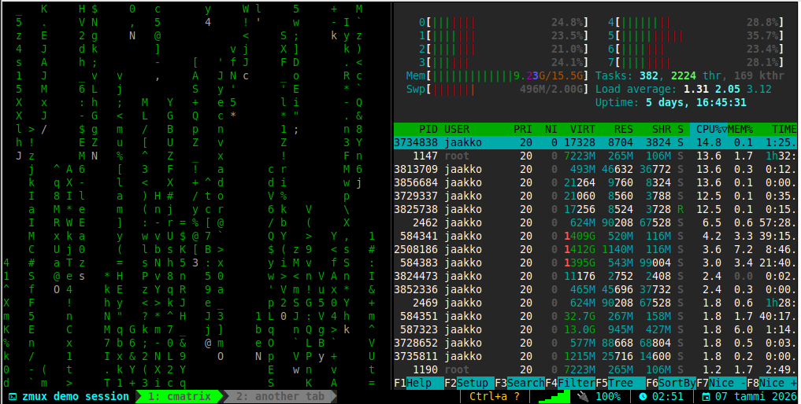

# zmux

**zmux** is a tmux configuration that makes tmux behave as closely as possible to [Zellij](https://zellij.dev/), providing a modern, modal terminal multiplexer experience.



## Features

- 🎯 **Zellij-like keybindings**: Modal interface with Pane, Tab, Resize, Move, Scroll, and Session modes
- 🎨 **Modern status bar**: Clean, minimal design inspired by Zellij
- 🔌 **Plugin integration**: Essential tmux plugins pre-configured
- 📦 **Easy installation**: One-command setup script
- 🔄 **Session management**: Automatic session save/restore with program re-launch
- 🔔 **Notifications**: `zmux notify` flashes your tab when a long command finishes or Claude Code needs your attention
- 🔁 **Auto-update**: Checks for new releases once per day; press `Ctrl+a u` to update

## Quick Start

### Install

```bash
curl -fsSL https://raw.githubusercontent.com/jvuori/zmux/master/get-zmux.sh | bash
```

For a non-interactive install (scripts/CI):

```bash
curl -fsSL https://raw.githubusercontent.com/jvuori/zmux/master/get-zmux.sh | bash -s -- --yes
```

Or from source:

```bash
git clone https://github.com/jvuori/zmux.git
cd zmux && ./install.sh
```

### First run

1. Start tmux: `zmux` (installed to `~/.local/bin/zmux`)
2. Install plugins: `Ctrl+a` then `i`
3. Done — your previous sessions restore automatically on next login

### Shell configuration (required)

zmux captures `Ctrl+p`, `Ctrl+n`, `Ctrl+h`, and others that your shell normally intercepts. Run once after install:

```bash
./setup-shell.sh && source ~/.zshrc   # or ~/.bashrc
```

See [docs/shell-config.md](docs/shell-config.md) for details.

### The `zmux` command

```
zmux / zmux start     Open or attach to a tmux session
zmux version          Print the installed version
zmux update           Check for a newer release and self-update
zmux notify           Flash the tmux tab to signal completion
zmux doctor           Run diagnostic checks
zmux help             Show help
```

## Key Bindings

zmux uses Zellij's modal keybindings — no prefix needed for mode entry:

| Key | Mode |
|-----|------|
| `Ctrl+p` | **Pane** — split, navigate, close panes |
| `Ctrl+t` | **Tab** — create, switch, rename windows |
| `Ctrl+n` | **Resize** — resize panes with arrow keys |
| `Ctrl+h` | **Move** — reorder panes |
| `Ctrl+s` | **Scroll** — enter copy/scroll mode |
| `Ctrl+o` | **Session** — switch sessions, create, detach |
| `Ctrl+g` | **Git** — fzf branch picker, commit picker, lazygit |
| `Ctrl+l` | **Lock** — pass all keys directly to the application |

### Quick actions (no mode needed)

| Key | Action |
|-----|--------|
| `Ctrl+q` | Detach from client (keeps daemon running) |
| `Ctrl+a r` | Reload config |
| `Ctrl+a u` | Update zmux |
| `Ctrl+o w` | Interactive session switcher (fzf) |

See [docs/keymap.md](docs/keymap.md) for the complete keymap reference.

## Documentation

- [Keymap Reference](docs/keymap.md) — Complete keybinding guide
- [Session Restore](docs/session-restore.md) — Autostart, program re-launch, manual save/restore
- [Shell Configuration](docs/shell-config.md) — Fixing shell key conflicts
- [Lock Mode](docs/lock-mode.md) — Pass-through mode for applications that need Ctrl+\*
- [Git Operations](docs/git-operations.md) — fzf branch/commit picker and lazygit integration
- [zmux notify](docs/notify.md) — Tab flash notifications for commands and Claude Code
- [Auto-Update](docs/auto-update.md) — How update checks and self-update work
- [Plugins](docs/plugins.md) — Plugin list and TPM management
- [Differences vs Zellij](docs/differences-vs-zellij.md) — What's different and why
- [Philosophy](docs/philosophy.md) — Design principles and goals
- [Troubleshooting](docs/troubleshooting.md) — Common issues and fixes

## Requirements

**Required:** tmux 3.0+, git, bash

**Optional (recommended):** fzf — needed for the session switcher and git operations

## Contributing

Issues and pull requests welcome at [github.com/jvuori/zmux](https://github.com/jvuori/zmux).

## License

This project is open source. See LICENSE file for details.

## Acknowledgments

- [Zellij](https://zellij.dev/) — For the excellent UX that inspired this project
- [tmux](https://github.com/tmux/tmux) — The powerful terminal multiplexer
- [TPM](https://github.com/tmux-plugins/tpm) — Tmux Plugin Manager
